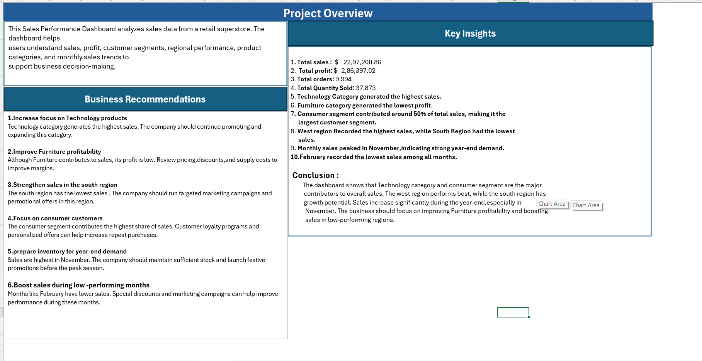

# 📊 Sales Performance Dashboard

An interactive Sales Performance Dashboard developed in Microsoft Excel to analyze retail sales data and generate meaningful business insights through data visualization.

---

## 🚀 Project Overview

This project demonstrates how Microsoft Excel can be used to transform raw sales data into an interactive dashboard. It includes KPI cards, Pivot Tables, Pivot Charts, and Slicers for dynamic analysis.

---

## ✨ Features

- Data Cleaning & Preparation
- Pivot Tables & Pivot Charts
- Interactive Dashboard
- KPI Cards
- Sales Trend Analysis
- Category-wise Performance
- Segment-wise Analysis
- Region-wise Analysis
- Interactive Slicers

---

## 🛠️ Tools Used

- Microsoft Excel
- Pivot Tables
- Pivot Charts
- Slicers
- Advanced Excel Formulas

---

## 📈 Dashboard Highlights

- 💰 Total Sales
- 📦 Total Orders
- 📊 Total Profit
- 📌 Total Quantity
- 📅 Monthly Sales Trend
- 🌍 Region-wise Performance
- 🛍️ Sales by Category
- 💹 Profit by Category
- 👥 Sales by Segment

---

## 📂 Project Files
[text](<Project- 01-Sales Performance- Dashboard-Final. x1sx.Xlsx>)
- 
- 

---

## 📷 Dashboard Preview

---

## 👤 Author

**Afifa khanam**

GitHub: https://github.com/Afifakhanam02/Excel_project_portfolio

LinkedIn: 